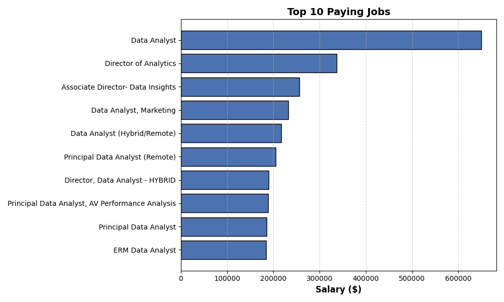

# Introduction
This project analyzes job market trends 📊 by examining job postings, required skills, salaries 💰, and demand for various roles. The goal is to provide insights into which skills are most valuable, which jobs pay the highest, and how skills impact salary and job demand across different industries.

With a special focus on Data Analysts 🧑‍💻📈, this project dives deep into the skills and trends shaping the Data Analyst job market, helping professionals and job seekers understand what it takes to succeed in this field.

🔍 SQL queries? Check them out here: [sql_queries folder](/sql_queries/)
# Background
The data used in this project is sourced from [job postings](https://drive.google.com/drive/folders/1egWenKd_r3LRpdCf4SsqTeFZ1ZdY3DNx), which include information about job titles, companies, locations, salaries, and required skills. By analyzing this data, we can identify trends in the job market and understand which skills are most sought after by employers across various roles.
### The question I wanted to answer through my SQL queries were:
1. Which Data Analyst roles offer the highest salaries?
2. What are the key skills required for high-paying Data Analyst positions?
3. What are the most sought-after skills for Data Analysts?
4. Which skills correlate with higher salaries for Data Analysts?
5. What are the best skills to acquire for optimal career growth as a Data Analyst?
# Tools I used
- **SQL:** Used for querying and analyzing data.
- **PostgreSQL:** Chosen as the database management system.
- **VS Code:** Used for writing and editing SQL queries and scripts.
- **Git & GitHub:** Utilized for version control and project sharing.
# The Analysis
The analysis is divided into four main queries:
### 1. Top Paying Jobs
This query identifies the top 10 highest-paying roles that are available remotely. The results are ordered by average yearly salary in descending order.
````sql
SELECT
    job_id,
    job_title,
    name AS company_name,
    job_location,
    job_schedule_type,
    salary_year_avg,
    job_posted_date
FROM job_postings_fact
LEFT JOIN company_dim ON company_dim.company_id = job_postings_fact.company_id
WHERE   
    job_title_short = 'Data Analyst'
    AND job_location = 'Anywhere'
    AND salary_year_avg IS NOT NULL
ORDER BY
    salary_year_avg DESC
LIMIT 10;
````
**Breakdown:**
- **Highest Paying Job:** The Data Analyst at Mantys offers the highest salary at $650,000.
- **Top 3 Roles:** The Director of Analytics at Meta ($336,500) and Associate Director at AT&T ($255,829.50) follow.
- **Salary Range:** Salaries range from $184,000 (ERM Data Analyst) to $650,000, with most jobs offering between $186,000 and $217,000.


*This **bar chart** displays the top 10 paying data analysis jobs sorted in descending order for easy comparison.*
### 2. Skills for Top Paying Jobs
This query identifies the skills required for the top-paying jobs. It provides a detailed look at which high-paying roles demand certain skills.
```sql
WITH top_paying_jobs AS (
    SELECT
        job_id,
        job_title,
        name AS company_name,
        salary_year_avg
    FROM job_postings_fact
    LEFT JOIN company_dim ON company_dim.company_id = job_postings_fact.company_id
    WHERE   
        job_title_short = 'Data Analyst'
        AND job_location = 'Anywhere'
        AND salary_year_avg IS NOT NULL
    ORDER BY
        salary_year_avg DESC
    LIMIT 10
)

SELECT 
    top_paying_jobs.*,
    skills
FROM top_paying_jobs
INNER JOIN skills_job_dim ON top_paying_jobs.job_id = skills_job_dim.job_id
INNER JOIN skills_dim ON skills_dim.skill_id = skills_job_dim.skill_id
ORDER BY
    salary_year_avg DESC
```
**Breakdown:**

- **High Demand for Data Skills:** SQL, Python, and Tableau are consistently mentioned across most job listings, indicating strong demand for these skills in the data analytics field.
- **Salary Range:** Salaries for data analyst positions vary, with the highest average salary being $255,829 (AT&T) and the lowest at $184,000 (Get It Recruit - IT).
- **Company Focus:** Large companies like AT&T, Pinterest, and SmartAsset dominate the listings, showcasing their need for skilled data professionals across different technical domains.


### 3. Most In-Demand Skills
This query identifies the top 5 most in-demand skills across all job postings. It retrieves the skills with the highest demand in the job market.
```sql
SELECT
    skills,
    COUNT(skills_job_dim.job_id) AS demand_count
FROM job_postings_fact
INNER JOIN skills_job_dim
    ON job_postings_fact.job_id = skills_job_dim.job_id
INNER JOIN skills_dim
    ON skills_dim.skill_id = skills_job_dim.skill_id
WHERE job_postings_fact.job_title_short = 'Data Analyst'
GROUP BY skills
ORDER BY demand_count DESC
LIMIT 5;
```
**Breakdown**
- **SQL and Excel** lead the demand, with SQL being essential for database management and Excel remaining a key tool for data analysis in business contexts.
- **Python, Tableau, and Power BI** are also highly in demand, demonstrating the strong need for advanced data analysis, visualization, and business intelligence skills.
### 4. Skills Based on Salary
This query analyzes the average salary associated with each skill across various roles. It reveals how different skills impact salary levels and helps identify the most financially rewarding skills to acquire or improve.
```sql
SELECT
    skills,
    ROUND(AVG(salary_year_avg),0) AS avg_salary
FROM job_postings_fact
INNER JOIN skills_job_dim
    ON job_postings_fact.job_id = skills_job_dim.job_id
INNER JOIN skills_dim
    ON skills_dim.skill_id = skills_job_dim.skill_id
WHERE job_postings_fact.job_title_short = 'Data Analyst'
    AND salary_year_avg IS NOT NULL
GROUP BY skills
ORDER BY avg_salary DESC
LIMIT 25;
```

**Breakdown:**
- **Machine Learning & AI:** Skills like Keras ($127K), Pytorch ($125K), and TensorFlow ($120K) show strong demand for expertise in data science and AI, with salaries ranging from $120K to $149K.
- **Cloud & Infrastructure:** Skills such as Terraform ($146K), VMware ($147K), and Kafka ($130K) highlight the need for professionals in cloud services and infrastructure management, with salaries between $116K and $160K.
- **Development Tools & Platforms:** Specialized tools like SVN ($400K), Solidity ($179K), and GitLab ($134K) demonstrate high demand in development and version control, with salaries ranging from $116K to $400K.
### 5. Skills Based on Salary
This query analyzes skills based on their demand and average salary across various roles. It helps identify the skills that are both in high demand and associated with higher salary levels, guiding decisions on which skills to focus on for career advancement.
```sql
SELECT
    skills_dim.skill_id,
    skills_dim.skills,
    COUNT(skills_job_dim.job_id) AS demand_count,
    ROUND(AVG(salary_year_avg),0) AS avg_salary
FROM job_postings_fact
INNER JOIN skills_job_dim 
    ON job_postings_fact.job_id = skills_job_dim.job_id
INNER JOIN skills_dim 
    ON skills_dim.skill_id = skills_job_dim.skill_id
WHERE
    job_postings_fact.job_title_short = 'Data Analyst'
    AND salary_year_avg IS NOT NULL
    AND job_work_from_home = TRUE
GROUP BY
    skills_dim.skill_id
HAVING
    COUNT(skills_job_dim.job_id) > 10
ORDER BY
    avg_salary DESC,
    demand_count DESC
LIMIT 25;
```

**Breakdown:**
- **Cloud & Big Data:** Skills like Snowflake, Azure, and AWS show strong demand with salaries ranging from $109K to $113K.
- **Programming & Data Analysis:** Go, Java, Python, and R are in demand, with salaries between $100K and $115K.
- **Business Intelligence & Analytics:** Tableau, Looker, and Qlik are sought after, with salaries ranging from $99K to $104K.
# What I learned
### **1. Advanced SQL Techniques 🛠️:**
I deepened my understanding of SQL by writing complex queries, joining multiple tables, and using aggregate functions to extract meaningful insights from large datasets. This project helped me master filtering, grouping, and sorting data efficiently.
### **2. Problem-Solving and Critical Thinking 🧠:**
This project challenged me to think critically about the data, ask the right questions, and solve problems methodically. These skills are transferable to any data-related role or project.
### **3. Data Visualization and Storytelling 📈:**
While analyzing the data, I learned how to present findings in a clear and compelling way. Whether through SQL results or visual graphs, I now understand the importance of storytelling in data analysis to communicate insights effectively.
# Conclusion
### **Insights**
This project uncovered key job market trends, highlighting the most in-demand skills 💡, top-paying roles 💰, and how skills impact salaries across industries. With a focus on Data Analysts 🧑‍💻, the analysis revealed that SQL, Python, and Excel dominate demand, while emerging tech skills like blockchain and AI frameworks command the highest salaries. These insights provide a roadmap for professionals to prioritize high-value skills and stay competitive in a rapidly evolving job market. 🚀📊
### **Closing Thoughts**
I enhanced my SQL skills by writing complex queries and using aggregate functions to extract insights. This project also sharpened my problem-solving and critical thinking abilities, allowing me to approach data methodically. Additionally, I learned the importance of data visualization and storytelling to present findings clearly and effectively.